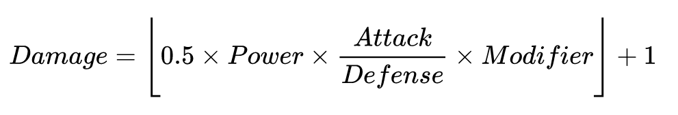

# Pokemon Battle Challenge

- [Pokemon Battle Challenge](#pokemon-battle-challenge)
  - [Challenge](#challenge)
  - [Setup](#setup)
    - [Available commands](#available-commands)
    - [Coverage reports](#coverage-reports)
  - [Pokemon Schema](#pokemon-schema)
    - [Bulbasaur](#bulbasaur)
    - [Charmander](#charmander)
  - [Moves](#moves)
    - [Hit Points (HP)](#hit-points-hp)
      - [Damage Calculation](#damage-calculation)
    - [Stat altering moves](#stat-altering-moves)

## Challenge
> Build a pokemon battle where two pokemon battle each other as shown in the video below.


## Setup

This repository is setup with typescript and ava.

Install all dependencies ready to go with:
```
npm i
```

### Available commands
```
npm run test
npm run test:watch
```

### Coverage reports

Mac
```sh
open ./coverage/lcov-report/index.html
```

Linux
```sh
xdg-open ./coverage/lcov-report/index.html
```


## Pokemon Schema

### Bulbasaur
```js
{
    name: 'Bulbasaur',
    type: 'GRASS',
    level: 5,
    hp: 21,
    stats: {
        attack: 11,
        defense: 11,
        speed: 11,
    },
    moves: [{
        name: 'Tackle',
        power: 40,
        type: 'NORMAL'
    }, {
        name: 'Growl',
        type: 'NORMAL'
    }]
}
```

### Charmander
```js
{
    name: 'Charmander',
    type: 'FIRE',
    level: 5,
    hp: 20,
    stats: {
        attack: 11,
        defense: 10,
        speed: 13,
    },
    moves: [{
        name: 'Scratch',
        power: 40,
        type: 'NORMAL'
    }, {
        name: 'Leer',
        type: 'NORMAL'
    }]
}
```

## Moves

### Hit Points (HP)

When a pokemon uses a move that has `power` then the damage should be calculated and the resulting value should be decremented from the defending pokemons `hp`

If a pokemons `hp` attribute drops to zero or below it loses the battle.

#### Damage Calculation



- *Power* is the attacking pokemons moves `power`
- *A* is the attacking pokemons `attack`
- *D* is the defenmding pokemons `defense`
- *Modifier* for this example will always be `0.1`

Damage should be an integer not a float.

### Stat altering moves

`Growl` and `Leer` can reduce the opposing pokemons stats within the current battle.

`Growl` affects the `defense` stat.

`Leer` affects the `attack` stat.

Stats can only be decreased a maximum of 6 stages.

| Stage | % Of Base Stat |
| ----- | -------------- |
| 0     | 100%           |
| -1    | 67%            |
| -2    | 50%            |
| -3    | 40%            |
| -4    | 33%            |
| -5    | 29%            |
| -6    | 25%            |
